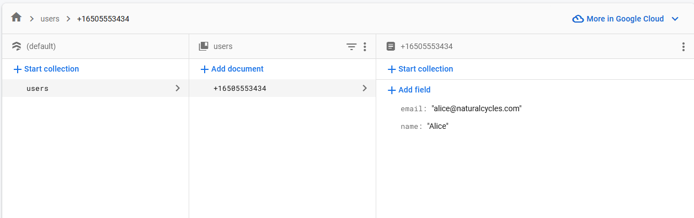
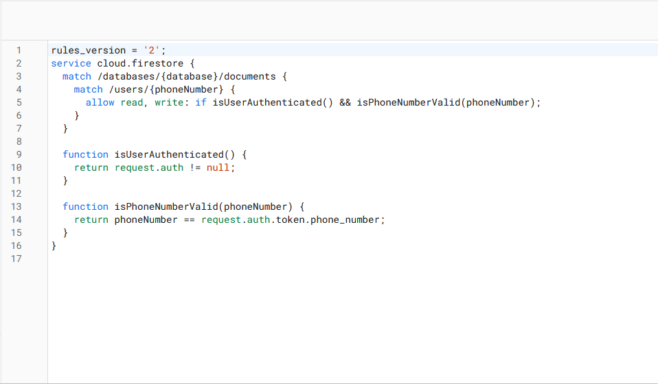
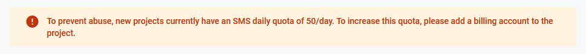

# Fullstack Engineer Challenge - sveltekit-firebase

This repository contains the solution to the Fullstack Engineer Challenge, as provided by [Natural Cycles](https://www.naturalcycles.com/).

## Overview

The challenge involves creating a web page that allows users to authenticate via mobile phone number (SMS code verification), update their profile information, and save it to a database. The solution consists of both a backend and frontend component and is deployed online on vercel and is availbe at: [https://sveltekit-firebase-zeta.vercel.app/](https://sveltekit-firebase-zeta.vercel.app/)

### Tech Stack

- Backend:
  - Node.js (firebase-admin)
  - TypeScript
- Frontend:
  - Firebase Auth
  - Firebase Firestore (as the database) using the firbase client side SDK
  - SvelteKit
  - TypeScript
- Hosting
  - Vercel

## Prerequisites

Before you begin, make sure you have the following tools and services set up:

- Node.js: [Install Node.js](https://nodejs.org/) if not already installed.
- Firebase: Set up a Firebase project and configure it with your Firebase Auth and Firestore database.
- `.env` file with the following setup:

```js
PUBLIC_FIREBASE_API_KEY = ''
PUBLIC_FIREBASE_AUTH_DOMAIN = ''
PUBLIC_FIREBASE_PROJECT_ID = ''
PUBLIC_FIREBASE_STORAGE_BUCKET = ''
PUBLIC_FIREBASE_MESSAGE_SENDER_ID = ''
PUBLIC_FIREBASE_APP_ID = ''
FIREBASE_ADMIN_PRIVATE_KEY = ''
```

## Getting Started

To set up and run the project, follow these steps:

1. Clone the repository:

   ```bash
   git clone [repository-url]
   cd [repository-folder]

   ```

2. Install packages with `npm install`

3. Run with NPM `npm run dev` and it should be available at `localhost:5173/`

## Testing

Fictional number for testing:

Phone number: `+1 650-555-3434`

Code: `654321`

## Firestore

### Database



### Rules



## Restrictions

To prevent abuse, new projects currently have an SMS daily quota of 50/day.
If that occurs, then please wait 24h before testing again.


